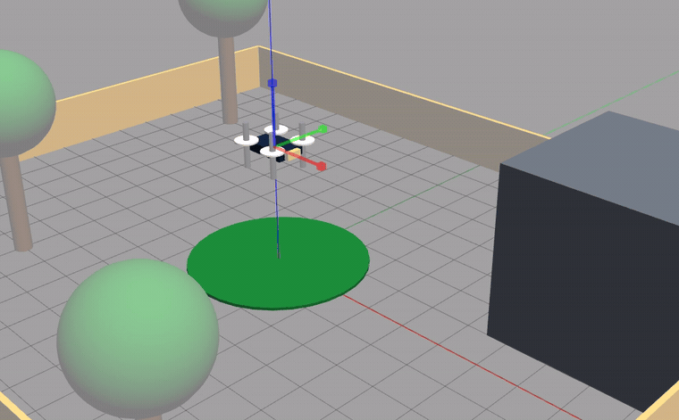

# Drone HIL Automation Lab

**End-to-end tests on a simulated drone in Gazebo, flown through ROS 2 and verified with Playwright.**

[](https://github.com/ForMat90/drone-hil-automation-lab/actions/workflows/tests.yml)

[Versione italiana](README.md) · [Try it with Docker](#try-it-with-docker) · [Getting started](#what-you-need-installed) · [How the pieces talk](#how-the-pieces-talk-to-each-other)



*Nobody is touching the keyboard: `npx playwright test` is flying the drone. Real-time video: [docs/demo.mp4](docs/demo.mp4).*

I run `npx playwright test` and the drone flies on its own inside the 3D scene: left, right, forward, backward, up, down and rotating. Every manoeuvre is checked by an assertion that verifies the command did what it promised.

### The interesting problem

Gazebo and ROS 2 run inside Linux (WSL) and talk over ROS messages. Playwright runs on Windows and talks HTTP. Those two worlds cannot call each other directly, so I wrote a **bridge service** that exposes four APIs and translates them into ROS commands — the same approach used to make microservices written in different languages talk to each other.

```
npx playwright test  ──HTTP──▶  Python bridge (:8765)  ──ROS 2──▶  Gazebo
   (Windows, JS)                    (Linux/WSL)                    (3D drone)
```

### What the project demonstrates

- **A complete test pyramid**: fast unit tests on the flight logic, end-to-end tests against the real running system.
- **Assertions on a physical system**: the checks verify a direction of travel instead of an exact value, because a simulation is never repeatable down to the millimetre.
- **Integration across processes and languages**: HTTP ⇄ ROS, Windows ⇄ Linux, JavaScript ⇄ Python.
- **Isolated tests**: the drone is recentred before each test and stopped when the suite ends.

### Stack

`Playwright` · `ROS 2 Humble` · `Gazebo 11` · `Python` · `JavaScript` · `pytest` · `WSL2`

### How it was built

This is a learning project: I am figuring out how flight simulators work and how you test a physical system rather than just a web page. I built it **using AI as an assistant** (Cursor), which I consider a normal part of the job today: I use it to explore technologies I do not know yet and to move faster through the mechanical parts.

The decisions are mine and verified by hand, though: how to keep manual flying separate from the automated tests, why the assertions check a direction instead of an exact value, how to tune the forces so the drone stays controllable. Everything written here has actually been run — the GIF above is a recording of a real test run, not a mockup.

---

The rest of this page is the practical guide: how to install it, how to fly the drone by hand and how to run the tests.

---

## How the project is organised

```
drone-hil-automation-lab/
├─ e2e/                          Playwright tests (JavaScript)
│  ├─ drone-commands.spec.js     the 9 tests and their assertions
│  └─ support/                   HTTP client + assertion rules
├─ src/drone_simulator/
│  ├─ flight_control.py          forces, speed caps, braking, flight envelope
│  ├─ simulator.py               offline flight model (the one under unit test)
│  ├─ gui.py                     lightweight 2D simulator, no Gazebo needed
│  └─ ros/                       the nodes that talk to Gazebo
│     ├─ bridge_server.py        the bridge: HTTP APIs ⇄ ROS
│     ├─ manual_control.py       keyboard ⇄ ROS, for manual flight
│     └─ boundary_guard.py       recentres the drone if it leaves the area
├─ scripts/                      launchers (.ps1 for Windows, .sh for Linux)
├─ gazebo/worlds/drone_lab.world the 3D world: drone, field, trees, warehouse, fence
├─ tests/                        pytest unit tests
├─ Dockerfile                    image with ROS 2, Gazebo and the bridge, headless
├─ docker/entrypoint.sh          starts the world, then the bridge, in that order
├─ docker-compose.yml            one command to get the drone listening on 8765
└─ docs/                         demo and the ROS/Gazebo install guide
```

---

## What you need installed

| What | Where it runs | Needed for |
|---|---|---|
| Windows 10/11 with WSL2 + Ubuntu 22.04 | — | running Linux inside Windows |
| ROS 2 Humble + Gazebo 11 | inside Ubuntu 22.04 | the 3D world and the drone |
| Python 3.10+ | Windows | the fast logic tests |
| Node.js | Windows | the Playwright tests |

First-time Gazebo/ROS install (once):

```powershell
wsl --install -d Ubuntu-22.04
wsl -d Ubuntu-22.04 -u root -- bash -lc "bash /mnt/c/Drone-HIL-Automation-Lab/scripts/install_real_gazebo.sh"
```

Test dependencies (once):

```powershell
cd C:\Drone-HIL-Automation-Lab
npm install
python -m pip install -r requirements.txt
```

The detailed ROS/Gazebo guide is in [docs/REAL_GAZEBO_SETUP.md](docs/REAL_GAZEBO_SETUP.md).

---

## Try it with Docker

If you just want to run the tests, or see the thing work, you do not have to install ROS and Gazebo: they are already inside the image. You only need **Docker and Node**.

```powershell
git clone https://github.com/ForMat90/drone-hil-automation-lab.git
cd drone-hil-automation-lab
npm install
docker compose up -d --build     # the first build downloads ROS and Gazebo: a few minutes
npx playwright test
docker compose down
```

The start command only returns once the container is `healthy`, which means Gazebo has loaded the world and the drone answers. To check by hand:

```powershell
npm run drone:pose     # {"x": 0.0, "y": 0.0, "z": 3.0, ...} = the drone is there
npm run drone:logs     # Gazebo and bridge logs, if something looks off
```

The real proof that it works is the nine green tests from `npx playwright test`.

The container publishes the bridge on `http://127.0.0.1:8765`, the same address the tests use when Gazebo runs in WSL: the tests are the very same files, there is no Docker-specific variant.

By default Gazebo runs headless, so **there is no 3D window**: the nine tests pass and you read the result in the terminal. On Windows, though, an override wires in the WSLg graphics channel and opens the window too, so you can watch the drone move while the tests run:

```powershell
npm run drone:up:gui
npx playwright test
```

No GPU reaches the container, so the scene is rendered in software: it looks fine, but it is heavier than the WSL route described in the three steps below.

---

## 1) Start Gazebo (always first)

```powershell
cd C:\Drone-HIL-Automation-Lab
.\scripts\run_gazebo_windows.ps1
```

The 3D window opens with the drone, the field, the trees, the warehouse and the orange fence.
Leave this terminal open: closing it closes Gazebo.

---

## 2) Fly the drone by hand

In a **second terminal**:

```powershell
cd C:\Drone-HIL-Automation-Lab
.\scripts\run_manual_control_windows.ps1
```

Keys:

| Key | What it does |
|---|---|
| `w` / `s` | forward / backward |
| `a` / `d` | left / right |
| `r` / `f` | up / down |
| `q` / `e` | rotate in place (yaw) |
| `x` | stop |
| `Ctrl+C` | quit manual control |

There is **no browser and no web address** here: the program reads the key and sends it straight to Gazebo.

If the drone leaves the area or climbs too high, it is automatically brought back to the center.

---

## 3) Automated tests (the drone flies on its own)

Leave Gazebo open and **close manual control** (`Ctrl+C`): if both are running they fight over the commands and the drone behaves strangely.

In a third terminal:

```powershell
cd C:\Drone-HIL-Automation-Lab
npx playwright test
```

Watch the Gazebo window: the drone takes off on its own, goes left, right, forward, backward, up, down and rotates.
The terminal shows the list of tests with ✓ or ✗.

At the end the drone is stopped and recentred. **Gazebo stays open**: close it whenever you want.

Useful commands:

```powershell
npx playwright test                          # all tests
npx playwright test -g "A:"                  # only the A command tests
npx playwright test --reporter=html          # browsable report
```

---

## 4) Fast logic tests (unit tests)

These **do not open Gazebo** and finish in under a second:

```powershell
cd C:\Drone-HIL-Automation-Lab
python -m pytest
```

---

## How the pieces talk to each other

This is the part that confuses people the most, so slowly.

The problem: **Gazebo and ROS run inside Linux (WSL) and speak "ROS"**, while **Playwright runs on Windows and speaks HTTP**. Two different worlds, two different languages. They cannot call each other directly.

The solution is the one used between microservices: put **a small service with an API** in the middle. That service is [src/drone_simulator/ros/bridge_server.py](src/drone_simulator/ros/bridge_server.py): it receives HTTP requests and forwards them to ROS.

```
  npx playwright test                    (Windows, JavaScript)
            │
            │  HTTP calls
            ▼
  http://127.0.0.1:8765                  <-- an API we wrote ourselves
  src/drone_simulator/ros/bridge_server.py   (Linux/WSL, Python)
            │
            │  ROS messages
            ▼
  Gazebo: the drone moves
```

### The APIs the tests use

| Call | What it does |
|---|---|
| `POST /api/hold` with `{ "command": "a" }` | hold the command down (like keeping a key pressed) |
| `POST /api/release` | let the command go: the drone brakes and stops |
| `GET /api/pose` | read where the drone is (x, y, z, velocity, yaw) |
| `POST /api/reset` | put the drone back at the center |

One test, step by step:

1. the test calls `POST /api/hold` with `a`;
2. the service translates it and publishes a leftward force on the ROS topic `/drone/gazebo_ros_force`;
3. Gazebo applies the force and the drone moves;
4. every 0.2 s the test calls `GET /api/pose` and records the position;
5. after 5 s it calls `POST /api/release`;
6. it checks the collected samples: "did it really go left?". If yes, the test passes.

### Two important notes

- **Playwright launches no browser here.** Playwright is normally used to test websites by clicking buttons; in this project it is only the tool that makes API calls and writes the assertions. The "result" is not read from a page, it is read in Gazebo and in the position numbers.
- **`http://127.0.0.1:8765` is not a website.** It is just the bridge between Windows and Linux: open it in a browser and it answers with a JSON listing the APIs. The bridge **starts on its own** when you run the tests (started by [e2e/support/global-setup.js](e2e/support/global-setup.js)). To start it manually: `.\scripts\run_bridge_windows.ps1`.

---

## What we actually verify

### Automated tests against Gazebo — [e2e/drone-commands.spec.js](e2e/drone-commands.spec.js)

The drone is recentred before every test, so one test cannot skew the next one.
Each command is held for **5 seconds**: long enough to see the movement with your own eyes in the 3D window.

| Test | What it checks |
|---|---|
| A / D: left, right | the drone moves sideways, the right way |
| W / S: forward, backward | the drone moves forward and backward |
| R / F: up, down | the drone changes altitude |
| A: comes back to the center at the end of the run | pushed to the edge of the area, the drone is brought back to the center |
| release: the drone stops | after releasing the command the speed drops to nearly zero and it does not keep sliding |
| Q and E rotate the drone | the drone rotates in place (yaw) |

### Unit tests — [tests/test_drone_simulator.py](tests/test_drone_simulator.py)

These cover the pure logic, without Gazebo: drone states (idle, armed, takeoff, hover, landing, emergency), takeoff, landing, emergency stop, the flight envelope and the fact that a held command stops on release.

Every push to GitHub runs **both levels**: the unit tests, and the end-to-end tests against the Docker container with headless Gazebo. That is the badge at the top of this page.

---

## Key files

| Path | What it is for |
|---|---|
| [scripts/run_gazebo_windows.ps1](scripts/run_gazebo_windows.ps1) | opens Gazebo from a Windows terminal |
| [scripts/run_manual_control_windows.ps1](scripts/run_manual_control_windows.ps1) | starts keyboard flying |
| [scripts/run_bridge_windows.ps1](scripts/run_bridge_windows.ps1) | starts the bridge manually (usually not needed) |
| [scripts/run_gazebo_3d.sh](scripts/run_gazebo_3d.sh) | the Linux script that actually launches Gazebo |
| [src/drone_simulator/ros/bridge_server.py](src/drone_simulator/ros/bridge_server.py) | the bridge: HTTP APIs ⇄ ROS, port 8765 |
| [src/drone_simulator/ros/manual_control.py](src/drone_simulator/ros/manual_control.py) | reads the keys and sends forces to ROS |
| [src/drone_simulator/flight_control.py](src/drone_simulator/flight_control.py) | command forces, speed caps, braking, flight envelope |
| [e2e/drone-commands.spec.js](e2e/drone-commands.spec.js) | the automated tests and their checks |
| [e2e/support/drone-api.js](e2e/support/drone-api.js) | the calls to the bridge: hold, read pose, reset |
| [e2e/support/flight-checks.js](e2e/support/flight-checks.js) | the assertion rules: "did it move left?", "is it stopped?" |
| [e2e/support/global-setup.js](e2e/support/global-setup.js) | before the tests: find or start the bridge |
| [playwright.config.js](playwright.config.js) | test configuration (timeout, ordering, reporter) |
| [tests/test_drone_simulator.py](tests/test_drone_simulator.py) | unit tests of the logic |
| [gazebo/worlds/drone_lab.world](gazebo/worlds/drone_lab.world) | the 3D world |
| [Dockerfile](Dockerfile) · [docker/entrypoint.sh](docker/entrypoint.sh) | ROS 2, Gazebo and the bridge in one headless image |
| [.github/workflows/tests.yml](.github/workflows/tests.yml) | CI: unit tests, plus end-to-end against the container |

To change how fast or how responsive the drone is, there is **a single file to touch**: `src/drone_simulator/flight_control.py`. It holds two groups of settings: the "hold" ones used by the bridge and the tests, and the "tap" ones used by the keyboard, which need a stronger push because each keypress is a single impulse.

---

## Extras

**Automatic area guard** (optional, in another terminal). Only useful if you keep Gazebo open with neither the keyboard nor the bridge running, since both of those already recentre the drone:

```powershell
wsl -d Ubuntu-22.04 -- bash -lc "source /opt/ros/humble/setup.bash; cd /mnt/c/Drone-HIL-Automation-Lab/src; python3 -m drone_simulator.ros.boundary_guard"
```

**Lightweight 2D simulator** (Python window, no Gazebo, handy to try the flight logic):

```powershell
python run_simulator.py
```

---

## Troubleshooting

| Symptom | Cause and fix |
|---|---|
| The tests say Gazebo is not open | run `.\scripts\run_gazebo_windows.ps1` first and wait for the 3D window |
| The Gazebo window closes immediately with a graphics error | run the script again: it kills leftover processes by itself |
| The drone does not react to the keys | Gazebo is not open, or you are typing in the wrong terminal |
| The drone behaves strangely during the tests | manual control is still running: close it with `Ctrl+C` |
| Playwright asks to install a browser | not needed: these tests use no browser. Make sure you run `npx playwright test` from the project folder |

---

## Notes on the tests and possible improvements

**How the tests work, briefly.** They do not check "an exact number", because a physics simulation never gives the same result twice. They check a **direction**: after holding `a`, the drone must have moved left by at least a few tens of centimetres. That keeps them stable and not annoying to maintain. The position is sampled throughout the movement and not only at the end, so a test does not fail if the drone was recentred in the meantime.

Things that would make the project stronger:

- **A deliberately failing test**, to prove the checks really work and do not always pass.
- **Collision tests**: verify the drone does not fly through the warehouse or the trees.
- **Landing-pad tests**, with a tolerance on precision.
- **Caching the image in CI**: the slowest step of the pipeline is building the image, because ROS and Gazebo are downloaded every time. Publishing the image to a registry would let the pipeline reuse it.
- **A single startup command for the 3D-window route too**: with Docker `docker compose up` is enough, but the WSL route still needs three terminals.
- **A real autopilot (PX4/SITL)** if the flight firmware ever needs simulating too: more realistic, but much heavier to install.
